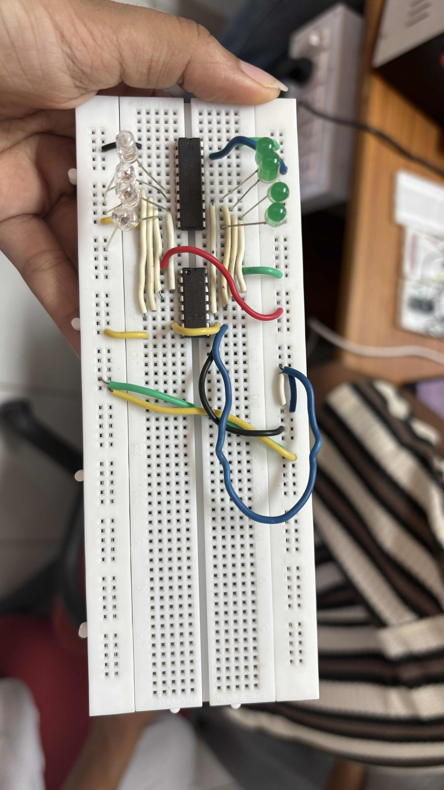
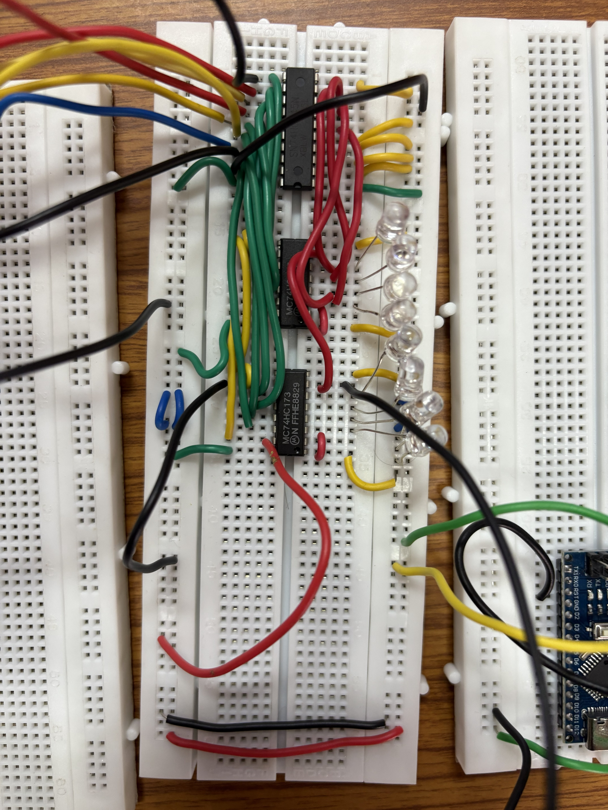
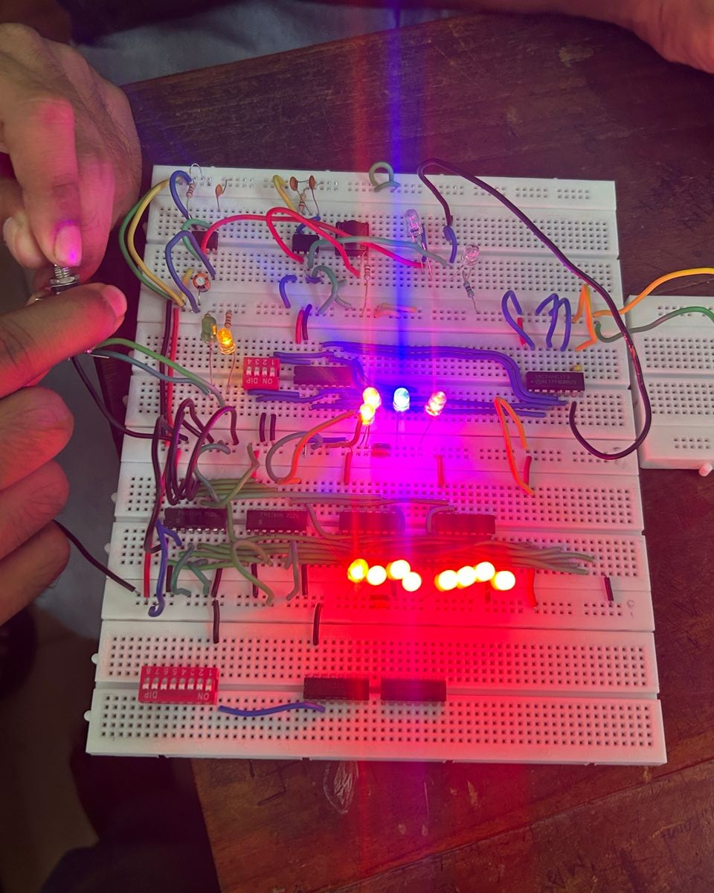
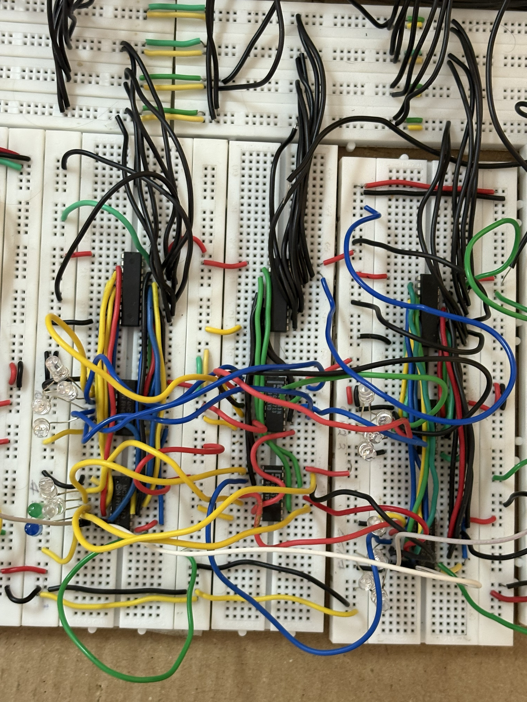
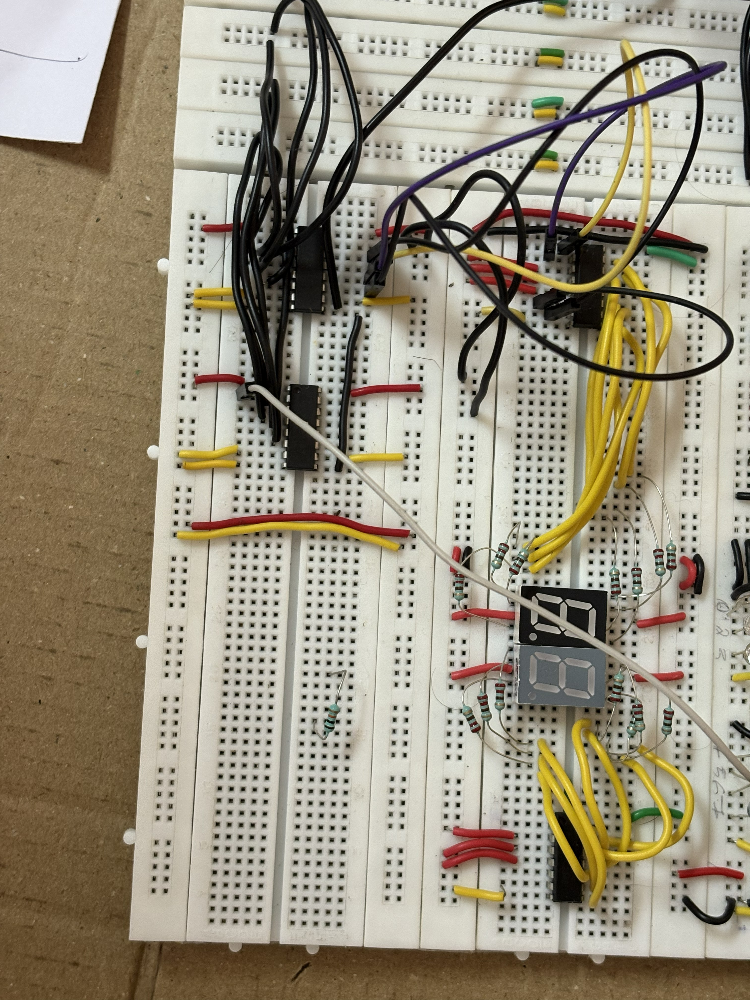
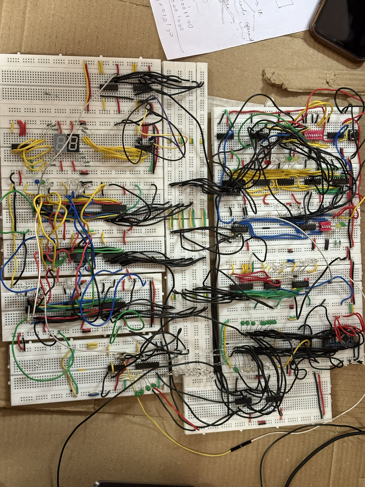

# 8-bit Computer using Arduino

> A fully functional 8-bit computer built from scratch using discrete components, with an Arduino-based clock and control unit.

---

## 🧠 Overview

This project demonstrates the internal working of a simple CPU by implementing a complete **Fetch–Decode–Execute cycle** using hardware.

Unlike simulations, this is a **physically built computer** where data flow and execution can be observed directly.

---

## ✨ Features

* 8-bit architecture
* Custom instruction set
* Arduino-based clock and control unit
* Register-based design
* ALU operations (ADD, SUB)
* Memory read/write support
* Real hardware implementation

---

## 🏗️ Architecture

The system is composed of key components working together:

* **Program Counter (PC)** – Holds address of next instruction
* **Memory** – Stores instructions and data
* **Instruction Register (IR)** – Holds current instruction
* **Control Unit (Arduino)** – Generates control signals
* **ALU** – Performs arithmetic operations
* **Registers** – Store intermediate values
* **Output Register** – Displays results

📄 Detailed explanation → [`architecture.md`](./architecture.md)

---

## 📜 Instruction Set

The complete instruction set and control signal details are documented in:

```
docs/Instruction_set.md
```

---

## ⚡ Execution Cycle

1. Fetch instruction from memory
2. Decode instruction
3. Execute operation

The cycle repeats until a `HLT` instruction is encountered.

---

## 💻 Arduino Control Unit

The Arduino is responsible for:

* Generating clock pulses
* Controlling timing steps (T0–T4)
* Producing control signals

📁 Code available in:

```
arduino/clock_control_unit/
```

---

## 📸 Media

<p align="center">
  <br>
  <em>Program Counter</em>
</p>

<p align="center">
  <br>
  <em>Instruction Register</em>
</p>

<p align="center">
  <br>
  <em>RAM</em>
</p>

<p align="center">
  <br>
  <em>ALU</em>
</p>

<p align="center">
  <br>
  <em>7-segment display</em>
</p>

<p align="center">
  <br>
  <em>8-bit computer</em>
</p>

Images and videos of the working system are available in the `media/` folder.

---

## 🎥 Demo

Download and view demo videos from the `media/videos/` folder.

---

## 📂 Project Structure

```
8-bit-computer/
│── arduino/
│── docs/
│── Media/
│── architecture.md
│── README.md
```

---

## 🚀 Getting Started

1. Clone the repository
2. Open the Arduino sketch in Arduino IDE
3. Upload to your board
4. Power the system

---

## 🧠 Learning Outcomes

* Computer architecture fundamentals
* Instruction-level execution
* Digital logic design
* Hardware-software integration

---

## 📜 License

MIT License
       